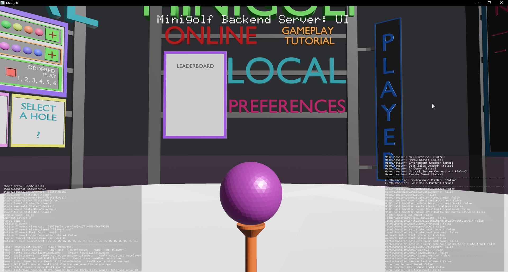

# bevy_easy_vec_ui

Written initially for Bevy 0.14.2. future support planned for 0.15.

Easy Vec to UI display system for bevy. Includes easy to set options for font & size, title, and data injection to be displayed on left or right half of the window.


The code below populates the above image:

Example: [main.rs]
```rust 
use bevy::prelude::*;
use bevy_easy_vec_ui::{BevyEasyVecUiPlugin, EasyVecUi};

fn main() {
    App::new()
        .add_plugins(DefaultPlugins)
        .add_plugins(BevyEasyVecUiPlugin::init("fonts/MatrixtypeDisplay-KVELZ.ttf")
            .camera_layer(-1)
            .title("Easy Vec to Ui Interface")
            .title_font_size(42.0) // Default is 42
            .data_font_size(12.0) // Default is 12
            .build()
        )
        .add_systems(Update, easy_vec_ui)
        .run();
}

fn easy_vec_ui(mut easy_vec_ui_resource: ResMut<EasyVecUi>) {
    let left_data_vec = vec![
            String::from("Left"),
            String::from("Vec"),
            String::from("Ui"),
            String::from("DATA"),
            String::from("Points"),
        ];
    let right_data_vec = vec![
            String::from("Right"),
            String::from("Vec"),
            String::from("Ui"),
            String::from("DATA"),
            String::from("Points"),
        ];
    easy_vec_ui_resource.inject_vec_left(left_data_vec);
    easy_vec_ui_resource.inject_vec_right(right_data_vec);
}
```

The system is useful for easy state monitoring for rapid development.

Example:

